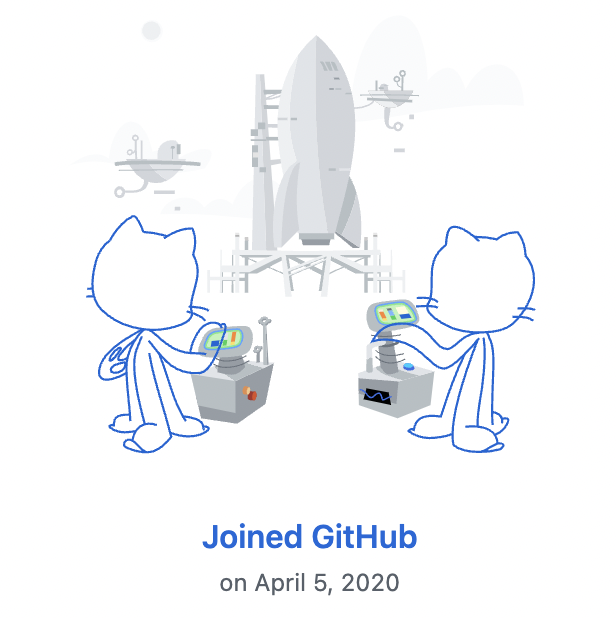

# How I Learned to Code from 2020 - 2022

## by Bezhuang

很难想象，时间一晃已经过去 800 多天，自己陆陆续续也捣鼓捣鼓了不少，我想是时候做一个阶段性的小总结，对于这在疫情中“荒废的青春”，也算是一种交代。

亚马逊热带雨林的蝴蝶扇扇翅膀，两周后的德克萨斯就引起了一场龙卷风，而在我的故事里，扇动翅膀的是一只蝙蝠。2020 年的伊始，新型冠状病毒开始席卷全球，打乱了许多原有的计划，我那时在申请转学出国，也因为这个原因最终没能走成。三月份的时候，在线慕课平台 [Coursera](https://coursera.org/) 推出了一些疫情期间限时免费和折扣的课程，其中有一门课程叫 [Python for Everybody](https://www.py4e.com)，那是一切关于梦想开始的地方，从什么都不会开始，到能够调包，跑跑简单的程序，复行数十步，豁然开朗。

19 到 20 年的冬天，有一个很火的 up 主叫巫师财经，才知道原来 b 站有个叫知识区的地方，我上视频网站还能学习，慢慢地跟着一些教程开始敲一些代码，这个仓库就是在那时开始建的，不过之前换电脑的时候嫌 `.git` 文件夹太大手贱直接删了，然后再提交就。这么多视频课中本人尤其推崇郝斌老师的自学课程，可以说是对我影响相当大，视频录制时间其实有点远古，还是要感谢网络时代和老师的分享精神，才能不让这样优秀的课程埋没于人海，让更多人能够受益。到后来慢慢接触、理解、相信、崇尚开源的理念，会去想成为这个奇妙的社会的一份，我想，也是从那个时候开始的吧。

那是 21 年初吧，b 站还没有视频笔记的功能，很多代码段直接拷贝到 word 或者手写下来总归有些古怪。正好，那时候接触到廖雪峰、阮一峰老师的网站，还有一些 CSDN 的文章，突发奇想，欸，我能不能也搭一个自己的博客，就记记平常学了什么，做了什么，就当是“自己想象的王国”。一开始是在 Wordpress 上，后来换到纯静态的 Hexo，能直接托管在 Github 上，那之后在 Coursera 上学数据分析师的专业证书课程，记了一些英文笔记，到年底的时候邮箱里突然收到有印度、美国的 ip 在网站上留言的提醒，还是有点激动的，那是你开始意识到可能这一切也不完全是自娱自乐，你开始在互联网中留下一些有关于你的印迹了，那是在那个时候推动你持续下去的动力，也谢谢你啊，陌生人。

网站是需要绑定域名，挂在服务器上的，就给自己租了一台阿里云的轻量应用服务器，又在阿里云网站的开发者社区中接触到一些 Java 后端开发的技术和整个的知识体系，逐渐萌生出我可以不仅仅是把它当作兴趣，而更多的是朝着当作一条职业发展的道路的思路，高并发、微服务这些名词开始在眼前晃，虽然可以预见的是可能很多年以后都只能说“还很遥远”，但也算是慢慢有的一些规划。出于这个角度，在我心里始终会为“阿里”两字留有蛮重的分量也就不难理解了，他时若遂凌云志。

从 21 年的后半段开始，是一场关于 408 的饥饿游戏，不过既然游戏还在继续，那就暂且按下不表，等到尘埃落定再回来看录像吧。年一过，眼睛一睁一眨就奔着 25 岁而来，4、5 月静止的上海裹挟着从未有过的焦虑。封城的时候，几乎每天做核酸都会碰到一个漂亮的小姐姐，女孩的眼睛总是亮晶晶的，一闪一闪的，好像是。后来我再也没见过她，于是知道很多美好的事情是没有结果的，甚至都不曾有过开始，但不妨碍它是美好的。所以这样来看青春是否就这么荒废了，我想是的，这一切都不会有什么结果的，我想是的。但现在与其说是我还会坚持，不如说是给自己保留一个念想，那是我的在我的小世界的一块应许之地。

仓库里整理好的这些代码，就算是这两年半的一些小小的见证，未来上一个台阶后，或许能有不同的视野，再开新的篇章吧。

写于 2022 年 6 月 18 日

## 内容汇总（Archive List）

| C/C++                   | Java                                        |
| ----------------------- | :------------------------------------------ |
| 郝斌 C 语言教程         | 阿里云 Java 初级训练营                      |
| 浙江大学数据结构        | 阿里云 Java 中级训练营                      |
| C 语言中文网从 C 到 C++ | 阿里云 Java 高级训练营                      |
| 普中 C51 单片机         | 尚硅谷 Java 基础教程                        |
|                         | 黑马 JavaSE 基础教程                        |
|                         | 黑马 JavaWeb 入门到企业实战                 |
|                         | Accenture Coding Virtual Experience Program |

| Python                       | Golang      | JavaScript                                                   |
| ---------------------------- | ----------- | ------------------------------------------------------------ |
| UMich - Python for Everybody | Go 语言之旅 | Programming with Mosh - Learn JavaScript in 1 hour           |
| Python + OpenCV 实现人脸识别 |             | Programming with Mosh - Object-oriented Programming in JavaScript |

## 笔记（Notes）

个人博客：https://blog.zhuangzhihao.top

